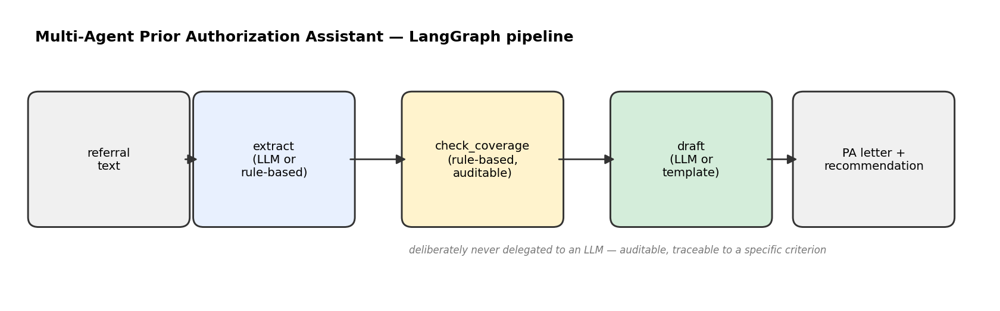
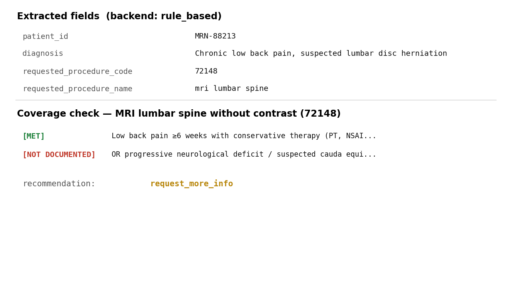
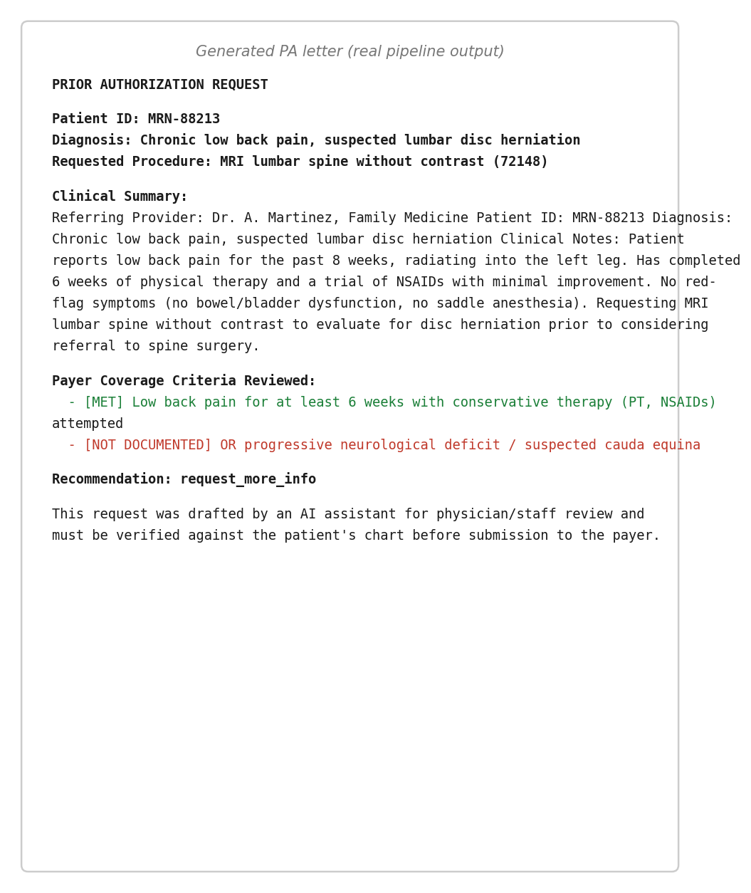
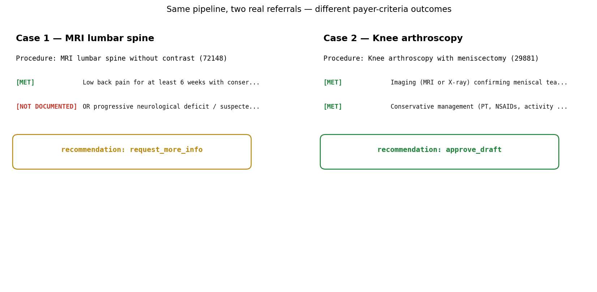

# Multi-Agent Prior Authorization Assistant

A LangGraph pipeline of three specialized agents that turns a clinical
referral note into a payer-ready prior authorization (PA) request draft:
one agent extracts structured details, one checks them against payer
coverage rules, and one drafts the request letter for staff review.

## Why three agents instead of one prompt

Prior authorization is a compliance-sensitive workflow: a wrong coverage
determination has real consequences for a patient's care. Splitting the
pipeline into agents with different jobs — and different levels of
autonomy — keeps that risk contained and the reasoning auditable:

| Agent | Job | Backend |
|---|---|---|
| **Extraction** (`extraction_agent.py`) | Pull patient ID, diagnosis, requested procedure out of free text | LLM (OpenAI/Anthropic) when configured, else rule-based regex/keyword matching |
| **Coverage** (`coverage_agent.py`) | Check the extracted procedure against the payer's documented criteria | **Always rule-based** — a deterministic, inspectable policy lookup, deliberately never delegated to an LLM |
| **Drafting** (`drafting_agent.py`) | Turn the extraction + coverage result into a letter | LLM for natural prose when configured, else a structured template |

The coverage agent is intentionally the least "AI" part of the system:
it's a transparent rule engine so every recommendation can be traced back
to a specific criterion and a specific piece of evidence in the note, and
it defaults to `request_more_info` rather than guessing whenever a
criterion isn't clearly documented.

## Pipeline (LangGraph)



<details>
<summary>Text version</summary>

```
referral text
     │
     ▼
┌─────────────┐     ┌──────────────────┐     ┌─────────────┐
│  extract     │ ──► │  check_coverage   │ ──► │   draft     │ ──► PA letter + recommendation
└─────────────┘     └──────────────────┘     └─────────────┘
```
</details>

Defined in `src/graph.py` as a `langgraph.graph.StateGraph` with one node
per agent and a shared state dict carrying the referral text, extracted
fields, coverage result, and final draft between steps.

## Real pipeline output

Running `src/graph.py` against `data/sample_referral.txt` (rule-based
backend, zero API keys) produces real extracted fields and a real coverage
determination:



...which the drafting agent turns into a full PA letter, ready for staff
review:



The coverage agent's rule-based design means two different referrals for
two different procedures produce two different, independently-explainable
recommendations from the same pipeline:



## Getting started

```bash
pip install -r requirements.txt

python src/graph.py --referral_file data/sample_referral.txt
```

Runs fully offline by default (no API key needed). To try the LLM-backed
extraction/drafting instead:

```bash
export ANTHROPIC_API_KEY=sk-...   # or OPENAI_API_KEY
python src/graph.py --referral_file data/sample_referral.txt
```

## Data

`data/payer_policies.json` is a small synthetic policy set (6 procedures,
some requiring prior auth with specific criteria, some not) modeled on how
real payer medical policies are structured. `data/sample_referral.txt` and
`data/sample_referral_knee.txt` are synthetic, de-identified referral
notes used for the two contrasting cases shown above.

## Tests

```bash
pytest tests/ -v
```

Covers: rule-based extraction of patient ID and procedure code, coverage
checks for a procedure that doesn't need PA, an unrecognized procedure
code, a procedure whose criteria are documented as met, template drafting
content, and two full end-to-end graph runs (a supported request, and a
mismatched one that should be flagged for more info rather than silently
approved).

## Project structure

```
prior-auth-assistant/
├── data/
│   ├── payer_policies.json
│   ├── sample_referral.txt
│   └── sample_referral_knee.txt
├── src/
│   ├── extraction_agent.py
│   ├── coverage_agent.py
│   ├── drafting_agent.py
│   └── graph.py            # LangGraph orchestration
├── tests/
│   └── test_pipeline.py
├── requirements.txt
└── README.md
```

## Tech stack

Python, LangGraph, OpenAI API / Anthropic (Claude) API (optional), pytest.

## Notes & limitations

- The coverage agent's criterion matching is keyword-based against free
  text, which is a simplification; a production system would read
  structured EHR fields (diagnosis codes, prior treatment history) rather
  than pattern-matching notes.
- When a policy lists criteria as alternatives ("X, OR Y"), this
  implementation still requires all listed criteria to show supporting
  evidence before recommending `approve_draft`, and falls back to
  `request_more_info` otherwise — an intentionally conservative default
  given the stakes of a wrong recommendation, at the cost of some false
  "needs more info" flags on cases that would actually qualify under the
  "OR" branch.
- All policy and referral data is synthetic; no real patient or payer data
  is used anywhere in this repo.
- The AI-drafted letter is explicitly labeled as requiring clinician/staff
  review before submission — this tool is a drafting aid, not an
  auto-submission system.
